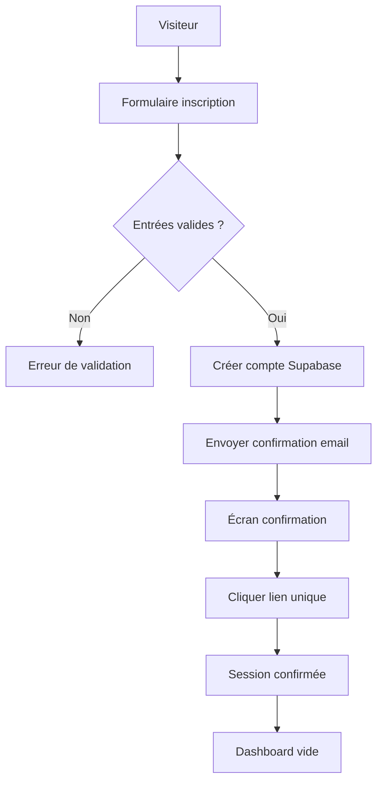
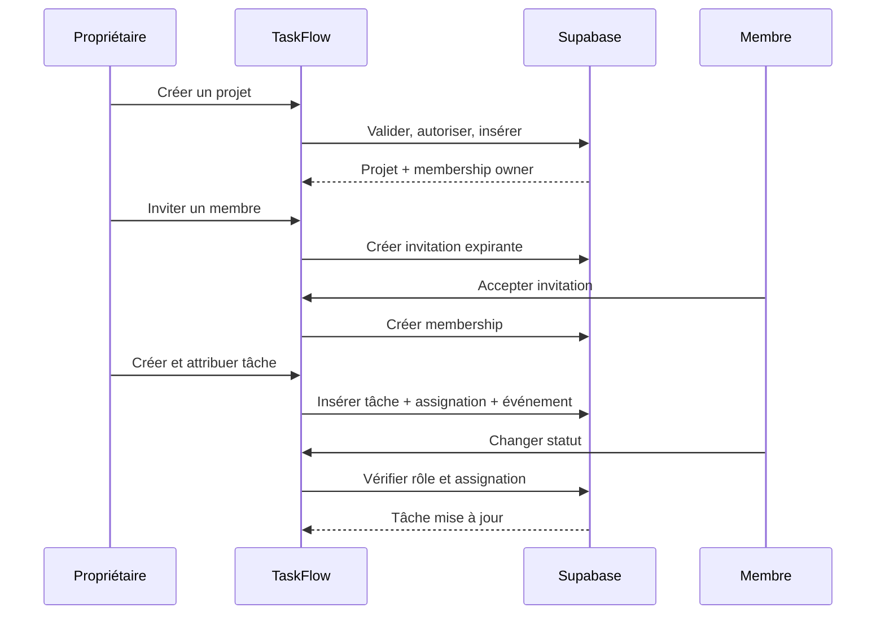

# Parcours utilisateurs MVP

Ces parcours définissent le comportement attendu avant l'implémentation. Chaque étape doit rester possible sur mobile et produire un état de chargement, d'erreur et de succès.

## Carte des routes

| Route | Accès | Rôle |
| --- | --- | --- |
| `/` | Public | Présentation et accès à la connexion |
| `/login` | Public | Connexion |
| `/register` | Public | Création de compte |
| `/confirm-email` | Public | Information de confirmation |
| `/dashboard` | Authentifié | Projets accessibles et activité récente |
| `/projects/new` | Authentifié | Création d'un projet |
| `/projects/[projectId]` | Membre du projet | Dashboard, tâches et membres |
| `/projects/[projectId]/tasks/[taskId]` | Membre du projet | Détail et commentaires d'une tâche |
| `/profile` | Authentifié | Profil et historique autorisé |
| `/settings` | Authentifié | Préférences et compte |

## Flux d'inscription

Un email déjà utilisé reçoit une réponse générique. Aucun écran public ne révèle si un compte existe.

## Flux projet et tâche

## États obligatoires

Chaque route protégée doit prévoir : chargement, succès, liste vide, erreur réseau, session expirée et accès interdit. Une mutation affiche un résultat idempotent ou une erreur exploitable sans détail interne.

## Cas de sécurité à tester

- observateur tente de créer une tâche : refus côté interface et serveur ;
- membre modifie une tâche non assignée : refus ;
- utilisateur extérieur lit un projet privé : refus RLS ;
- invitation expirée : refus et possibilité de renvoi ;
- session expirée pendant une mutation : redirection vers login sans perte d'information sensible.
